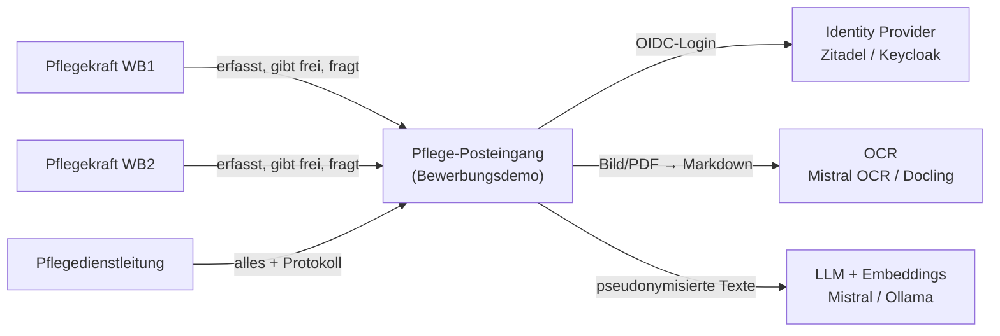
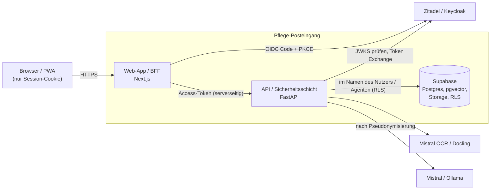

# C4-Diagramme

## Kontext (C4 Level 1)

```mermaid
flowchart LR
    pk1["Pflegekraft WB1"]
    pk2["Pflegekraft WB2"]
    pdl["Pflegedienstleitung"]
    sys["Pflege-Posteingang<br/>(Bewerbungsdemo)"]
    idp["Identity Provider<br/>Zitadel / Keycloak"]
    ocr["OCR<br/>Mistral OCR / Docling"]
    llm["LLM + Embeddings<br/>Mistral / Ollama"]

    pk1 -- "erfasst, gibt frei, fragt" --> sys
    pk2 -- "erfasst, gibt frei, fragt" --> sys
    pdl -- "alles + Protokoll" --> sys
    sys -- "OIDC-Login" --> idp
    sys -- "Bild/PDF → Markdown" --> ocr
    sys -- "pseudonymisierte Texte" --> llm
```

## Container (C4 Level 2)

```mermaid
flowchart LR
    browser["Browser / PWA<br/>(nur Session-Cookie)"]
    subgraph system["Pflege-Posteingang"]
        web["Web-App / BFF<br/>Next.js"]
        api["API / Sicherheitsschicht<br/>FastAPI"]
        db[("Supabase<br/>Postgres, pgvector,<br/>Storage, RLS")]
    end
    idp["Zitadel / Keycloak"]
    ocr["Mistral OCR / Docling"]
    llm["Mistral / Ollama"]

    browser -- "HTTPS" --> web
    web -- "OIDC Code + PKCE" --> idp
    web -- "Access-Token (serverseitig)" --> api
    api -- "JWKS prüfen, Token Exchange" --> idp
    api -- "im Namen des Nutzers / Agenten (RLS)" --> db
    api --> ocr
    api -- "nach Pseudonymisierung" --> llm
```
